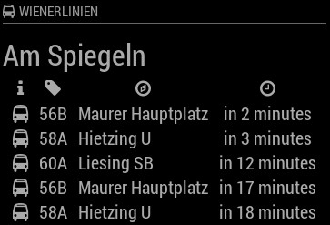
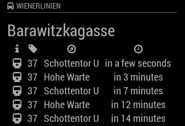

# MMM-WienerLinien
Public Transport of Vienna/Austria Module for MagicMirror<sup>2</sup>

## Example

 

## Dependencies
  * An installation of [MagicMirror<sup>2</sup>](https://github.com/MichMich/MagicMirror)
  * npm
  * [request](https://www.npmjs.com/package/request)

## Installation
 1. Clone this repo into `~/MagicMirror/modules` directory.
 2. Configure your `~/MagicMirror/config/config.js`:

    ```
    {
        module: "MMM-WienerLinien",
        position: "top_right",
        config: {
            api_key: "xxxxxxxxxxx",
            stations: ["2545", "1668"],
            ...
        }
    }
    ```
 3. Run command `npm install` in `~/MagicMirror/modules/MMM-WienerLinien` directory.

## Config Options
| **Option** | **Default** | **Description** |
| --- | --- | --- |
| `api_key` | REQUIRED | Get an API key for free access to the data of www.wienerlinien.at [here](https://www.wien.gv.at/formularserver2/user/formular.aspx?pid=3b49a23de1ff43efbc45ae85faee31db&pn=B0718725a79fb40f4bb4b7e0d2d49f1d1). |
| `stations` | REQUIRED | Insert here the station ids you want to display data from [How to find an ID?](https://till.mabe.at/rbl/). |
| `max` | `5` | How many departures should be displayed. |
| `shortenStation` | `false` | After how many characters the station name should be cut. Default: show full name. |
| `shortenDestination` | `false` | After how many characters the destination name should be cut. Default: show full name. |
| `rotateInterval` | `20000` (20 sec) | How fast should be switched between the stations. |
| `updateInterval` | `300000` (5 mins) | How often should the data be fetched. |
