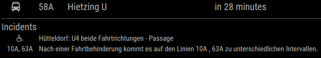

[](https://raw.githubusercontent.com/fewieden/MMM-WienerLinien/master/LICENSE) [](https://codeclimate.com/github/fewieden/MMM-WienerLinien) [](https://snyk.io/test/github/fewieden/mmm-wienerlinien)

# MMM-WienerLinien

Public Transport of Vienna/Austria Module for MagicMirror<sup>2</sup>

## Example

  

## Dependencies

* An installation of [MagicMirror<sup>2</sup>](https://github.com/MichMich/MagicMirror)
* npm
* [node-fetch](https://www.npmjs.com/package/node-fetch)

## Installation

* Clone this repo into `~/MagicMirror/modules` directory.
* Configure your `~/MagicMirror/config/config.js`:

```js
{
    module: 'MMM-WienerLinien',
    position: 'top_right',
    config: {
        stations: ['2545', '1668'],
        // Place the other config options here
    }
}
```

* Run command `npm install --production` in `~/MagicMirror/modules/MMM-WienerLinien` directory.

## Config Options

| **Option** | **Default** | **Description** |
| --- | --- | --- |
| `stations` | REQUIRED | Insert here the station ids you want to display data from [How to find an ID?](https://till.mabe.at/rbl/). |
| `max` | `5` | How many departures should be displayed. |
| `shortenStation` | `false` | After how many characters the station name should be cut. Default: show full name. |
| `shortenDestination` | `false` | After how many characters the destination name should be cut. Default: show full name. |
| `rotateInterval` | `20000` (20 sec) | How fast should be switched between the stations. |
| `updateInterval` | `300000` (5 mins) | How often should the data be fetched. |
| `elevatorStations` | EMPTY  | Insert the station ids where you would like to know elevator disruptions. |
| `incidentLines` | EMPTY  | Insert the line names for which you would like to know disruptions. |
| `incidentShort` | `false` | If true, also the changes to lines are displayed (AZBLinienspezialtext [see documentation](https://data.wien.gv.at/pdf/wienerlinien-echtzeitdaten-dokumentation.pdf)), otherwise only current disruptions. |
